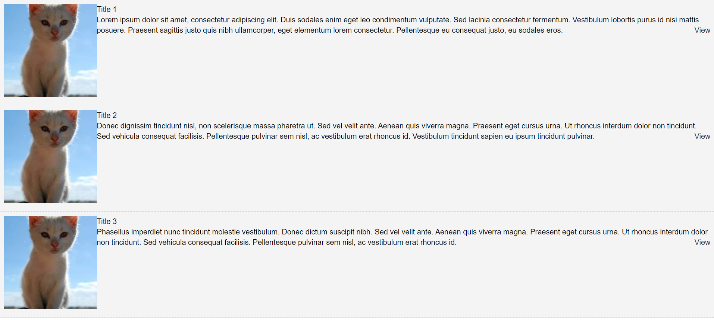

# My first introduction to React

## Table of contents

- [Overview](#overview)
- [Screenshot](#screenshot)
- [My process](#my-process)
  - [Built with](#built-with)
  - [What I learned](#what-i-learned)

  ## Overview

  This is a practice project I created when I was first intoduced to React. The project was build during a cource in programming while I was still a studying at Metropolia University of Applied Sciences. The application is very bare-bones and the goal was to introduce students into basics of React. The application was built using class based components, since that seemed to be the norm in the early 2018.

  The application is a simple single-page-application that displays 3 identical kitten images taken from a local state. Use of APIs to get the images was left out of the project, since the focus was kept mainly on basics of React.

  ## Screenshot

  

  ## My Process

  ### Built with

  - Sematic HTLM5 markup
  - CSS
  - JavaScript
  - [React](https://reactjs.org/) - JS library

  ### What I learned

  While making this project, I learned the basics of React. I learned to work with Reacts components and got an introduction to JSX.